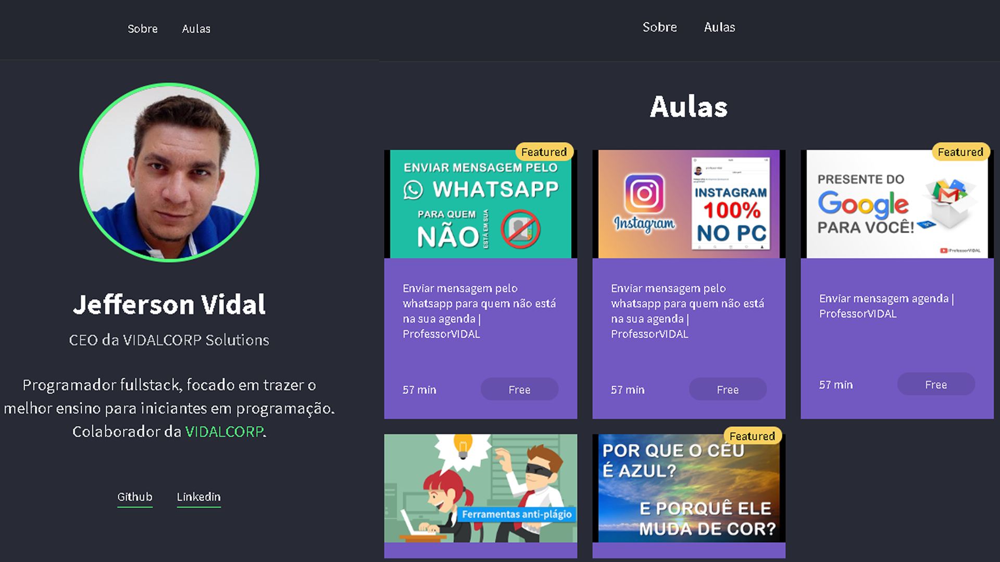

<h1 align="center">
    
</h1>

<h3 align="center" >
  Portfólio Launchbase 2.0
</h3>

  Projeto da Launchbase 2.0 da Rocketseat. Website portfólio desenvolvido com HTML5, CSS 3, Javascript.

  
  
  
  
  

  
  
  
  
  
  

  <a href="#Estrutura">Estrutura do Projeto</a>&nbsp;&nbsp;&nbsp;|&nbsp;&nbsp;&nbsp;
  <a href="#Bibliotecas">Bibliotecas Usadas</a>&nbsp;&nbsp;&nbsp;|&nbsp;&nbsp;&nbsp;
  <a href="#Caracteristicas">Características do Projeto</a>&nbsp;&nbsp;&nbsp;|&nbsp;&nbsp;&nbsp;
  <a href="#Screenshots">Screenshots</a>&nbsp;&nbsp;&nbsp;|&nbsp;&nbsp;&nbsp;
  <a href="#License">License</a>

## Estrutura do Projeto

- [x] Frontend - Aplicação versão web com HTML5, CSS 3 e JavaScript;

## Sites, softwares, bibliotecas, apis utilizadas

* NodeJS - https://nodejs.org/dist/v12.16.1/node-v12.16.1-x64.msi;
* Express - Microframework que trata as requisições e rotas - "npm install express";
* Insomnia - https://insomnia.rest/download/ - Testar métodos e rotas;

## Características do projeto

## Screenshots

  

  
  
  

## License

This project is under MIT. See at here [LICENSE](/LICENSE) for more informations.

---

Made with ♥ by [Jefferson Vidal](https://github.com/jeffersonvidal)
